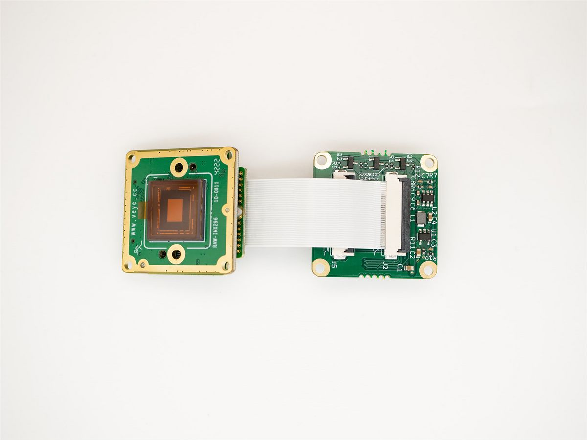
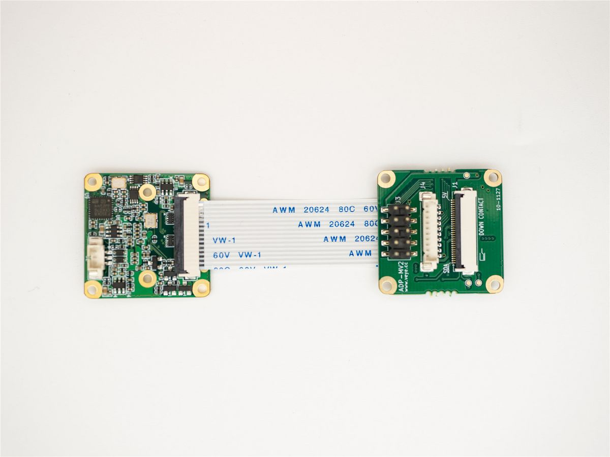
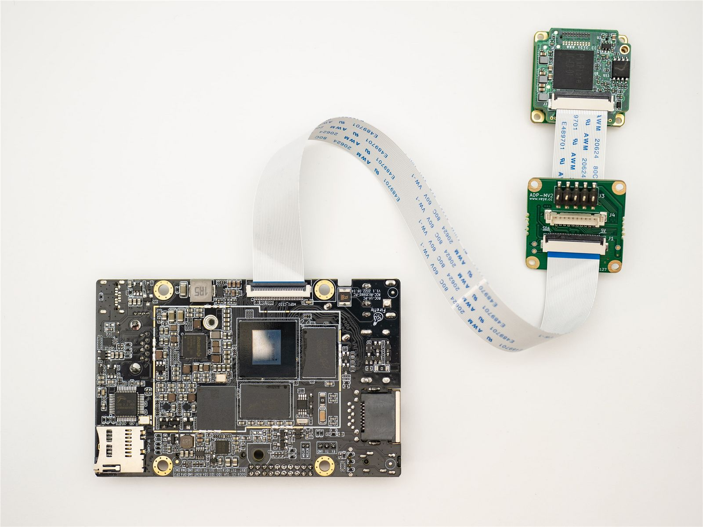

# How to use MV and RAW series cameras on Firefly's RK35XX board
This is a mirror of [our wiki article](http://wiki.veye.cc/index.php/MV_Camera_on_Firfly_Boards).

[toc]

## Overview
The MV series and RAW series cameras are cameras designed for AI applications in the industrial field. They use the MIPI CSI-2 interface and are particularly suitable for use with embedded computing platforms. They have rich data formats and triggering features, extremely low latency, high bandwidth, and reliable stability.

This article takes Firefly's ROC-RK3588S-PC motherboard as an example to introduce how to connect MV and RAW series cameras to the RK3588S/RK3588 system.

We provide drivers for the Linux operating system (using Ubuntu as an example).

### Camera Module List

| Series  | Model  | Status  |
| ------------ | ------------ | ------------ |
| MV Series  | MV-MIPI-IMX178M  | Done  |
| MV Series  | MV-MIPI-IMX130M  | Done  |
| MV Series  | MV-MIPI-IMX296M  | Done  |
| MV Series  | MV-MIPI-IMX287M  | Done  |
| MV Series  | MV-MIPI-IMX265M  | Done  |
| MV Series  | MV-MIPI-IMX264M  | Done  |
| RAW Series  | RAW-MIPI-SC132M	  | Done  |

## Hardware Setup

The MV series and RAW series cameras require an ADP-MV2 adapter board to connect to the ROC-RK35xx-PC motherboard.
### Connection of MV-MIPI-CAM and ADP-MV2
The two are connected using 0.5 mm pitch*30P FFC cable with opposite direction. The cable must be inserted with the silver contacts facing outside.


### Connection of RAW-MIPI-CAM and ADP-MV2
The two are connected using 1.0 mm pitch*15P FFC cable with opposite direction. The cable must be inserted with the silver contacts facing outside.



### Connection with Main board using ADP-MV2



## Introduction to github repositories

https://github.com/veyeimaging/rk35xx_firefly

includes：
- driver source code
- i2c toolkits
- application demo
In addition, a compiled linux kernel installation package and Android image is provided in the [releases](https://github.com/veyeimaging/rk356x_firefly/releases).

## Upgrade Firefly Ubuntu system

For the ROC-RK3588S-PC, we have provided an image of the release system.

Download the latest rk358x_firefly_ubuntu.tar.gz from https://github.com/veyeimaging/rk35xx_firefly/releases/ .

Refer to the [Firefly documentation](https://wiki.t-firefly.com/en/ROC-RK3588S-PC/upgrade_bootmode.html) to burn in a standard system.

## Check system status
### Whether the camera is correctly recognized
After system update, reboot the main board.

Execute the following command on the main board to check if the camera is properly connected.
```
dmesg | grep mvcam
```
You can see the camera model and the camera version number probed.

A prompt as below indicates that the MV-MIPI-IMX296M camera is detected on the i2c-7 bus.
```
mvcam 7-003b: camera is：MV-MIPI-IMX296M

mvcam 7-003b: firmware version: 0x1290133
```
- Check the video0 device node:
```
ls /dev/video0
```
You should see:
```
video0
```
After successfully identifying the camera, the camera will be recognized as /dev/video0.

### Using media-ctl to view topology

Using the media-ctl command can clearly display the current topography structure.
```
media-ctl -p -d /dev/media0
```
#### Link relationship
mv camera->rockchip-csi2-dphy0->rockchip-mipi-csi2->stream_cif_mipi_id0 - - ->DDR(/dev/video0)

The application can obtain images through the /dev/video0 node.
#### mv camera entity information
Taking the MV-MIPI-IMX296M as an example:
```
- entity 63: m00_b_mvcam 7-003b (1 pad, 1 link)
             type V4L2 subdev subtype Sensor flags 0
             device node name /dev/v4l-subdev2
        pad0: Source
                [fmt:Y8_1X8/1456x1088@100/6000 field:none]
                -> "rockchip-csi2-dphy0":0 [ENABLED]
```
You can see that:

- The complete name of this entity is: `m00_b_mvcam 7-003b`.
- It is a V4L2 subdev (Sub-Device) Sensor.
- Its corresponding node is `/dev/v4l-subdev2`, which can be opened and - configured by applications (such as `v4l2-ctl`).
- Its output format is `[fmt:Y8_1X8/1456x1088@100/6000 field:none]`, where - `Y8_1X8` is a shorthand for a mbus-code, which will be listed in the next section of this article.
- The current resolution is `1456x1088`.
- The current frame interval is `100/6000`, which means the frame rate is 60.
- The data format output by the camera can be modified using the media-ctl command.

#### mbus-code list
MV series and RAW series cameras have different data format capabilities, which can be found in the data manual for each camera model.
| Format on datasheet  | mbus-code for media-ctl  | pixelformat for v4l2-ctl  |
| ------------ | ------------ | ------------ |
| RAW8	| Y8_1X8 |	GREY | 
| RAW10	| Y10_1X10 |	'Y10 ' | 
| RAW12	| Y12_1X12 |	'Y12 ' | 
| UYVY	| UYVY8_2X8 |	UYVY | 

## Raw data format
The VICAP module of RK3588 supports two data saving formats, Compact and Noncompact RAW. You can modify the mode using the RKCIF_CMD_SET_CSI_MEMORY_MODE ioctl command of RKCIF. By default, the output is in Compact RAW format.


### Noncompact RAW
For pixel data with 10-bit depth or 12-bit depth, two bytes are always used to store one pixel. This storage method is convenient for software processing, but it has the disadvantage of occupying a large amount of space.

Depending on whether the effective data is stored in the high bits or low bits, it can be further divided into two types: high align and low align.

#### Noncompact RAW(high align)
Data is saved to the high bits, and the unused low bits are filled with 0. This is one of the data formats supported by RK VICAP.

#### Noncompact RAW(low align)
In Noncompact RAW (low align) format, data is saved to the low bits, and the unused high bits are filled with 0. The V4L2 standard 'Y10' (10-bit Greyscale) and 'Y12' (12-bit Greyscale) formats are both stored in this way.

The pixel_layer_convert conversion tool mentioned later in the article also converts Compact RAW to this storage format for easy display using image players.

### Compact RAW
As shown above，there is no bit padding between pixels in this storage format.

### Line stride
To facilitate fast operations on images, the system usually provides row-aligned buffer sizes for each line of data. RK3588 uses 256-byte alignment for this purpose.

line_stride = ALIGN_UP（image_width*bits_per_pixel/8,256）

For example, when the image width is 1456:

8bit depth，line_stride=1536

10bit depth，preferred_stride=2048

12bit depth，preferred_stride=2304

### Format convert tool
We have written a small tool: pixel_layer_convert, which can easily convert Compact images to Noncompact (low align) images.

For example, the following command can convert a Compact RAW10 image with a width of 1456 to Noncompact RAW10 format:
```
./pixel_layer_convert -I R10C -i y10-1456x1088_0001.raw -o y10-1456x1088_0001_new.raw -w 1456
```
### Raw data image player
We recommend using [vooya](https://www.offminor.de/) as the player, which supports GREY, and unpacked image formats.

Also, y8 file can be used with this player: [YUV Displayer Deluxe](https://yuv-player-deluxe.software.informer.com/2.6/).

## Application examples
###  Configuring  global variables
For the convenience of later descriptions, global variables are configured here according to the sensor size.
- MV-MIPI-IMX178M
```
export WIDTH=3088
export HEIGHT=2064
export FPS=22
```
- MV-MIPI-SC130M
```
export WIDTH=1280
export HEIGHT=1024
export FPS=108
```
- MV-MIPI-IMX296M
```
export WIDTH=1456
export HEIGHT=1088
export FPS=60
```
- MV-MIPI-IMX287M
```
export WIDTH=704
export HEIGHT=544
export FPS=319
```

- MV-MIPI-IMX265M
```
export WIDTH=2048
export HEIGHT=1544
export FPS=45
```
- MV-MIPI-IMX264M
```
export WIDTH=2432
export HEIGHT=2056
export FPS=28
```
- RAW-MIPI-SC132M
```
export WIDTH=1080
export HEIGHT=1280
export FPS=120
```
### Configure parameters using v4l2-ctl
$ v4l2-ctl -d /dev/v4l-subdev2 -L
```
User Controls

                   trigger_mode 0x00981901 (int)    : min=0 max=2 step=1 default=0 value=0 flags=volatile, execute-on-write

                    trigger_src 0x00981902 (int)    : min=0 max=1 step=1 default=1 value=1 flags=volatile, execute-on-write

                    soft_trgone 0x00981903 (button) : flags=write-only, execute-on-write

                     frame_rate 0x00981904 (int)    : min=1 max=60 step=1 default=60 value=60 flags=volatile, execute-on-write

                          roi_x 0x00981905 (int)    : min=0 max=1376 step=8 default=0 value=0

                          roi_y 0x00981906 (int)    : min=0 max=1024 step=4 default=0 value=0
```

Parameters can be set and get using the following methods.
```
v4l2-ctl --set-ctrl [ctrl_type]=[val]
v4l2-ctl --get-ctrl [ctrl_type]
```
All the above functions can be implemented using [mv_mipi_i2c.sh](http://wiki.veye.cc/index.php/Mv_mipi_i2c.sh_user_guide).

Note that the above parameters cannot be modified during the capture process.

The following is an explanation of each parameter:

#### Trigger Mode
`v4l2-ctl --set-ctrl trigger_mode=[0-2]`
0：Video streaming mode
1：Normal trigger mode.
2：High-speed continuous trigger mode.

#### Trigger Source
`v4l2-ctl --set-ctrl trigger_src=[0-1]`

0: Software trigger mode.
1: Hardware trigger mode.

#### Software trigger command
`v4l2-ctl --set-ctrl soft_trgone=1`

#### Set frame rate
`v4l2-ctl --set-ctrl frame_rate=[1-max]`
The maximum frame rate is automatically updated as the resolution changed.

#### Set the starting position of the ROI
```
v4l2-ctl -d /dev/v4l-subdev2 --set-ctrl roi_x=0
v4l2-ctl -d /dev/v4l-subdev2 --set-ctrl roi_y=0
```
After setting the ROI starting position, you need to complete the full ROI configuration using the media-ctl command.

Note that setting the ROI may affect the maximum frame rate, and the ROI parameters need to meet the requirements specified in the camera manual.

### Set image format using media-ctl
use the following command to configure the camera's data format, resolution, and frame rate using media-ctl:
```
media-ctl -d /dev/media0 --set-v4l2 '"m00_b_mvcam 7-003b":0[fmt:Y8_1X8/'"$WIDTH"'x'"$HEIGHT"'@1/'"$FPS"']'
```
Among them: `"m00_b_mvcam 7-003b"` refers to the complete name of the camera entity, `Y8_1X8` is the mbus-code, `'"$WIDTH"'x'"$HEIGHT"'` indicates the resolution, `1/'"$FPS"'` indicates the resolution frame rate.

The width and height here cooperate with the `roi_x` and `roi_y` of the v4l2-ctl command to form the ROI parameter.

For example, for MV-MIPI-IMX296M, the command after variable replacement would be:
```
media-ctl -d /dev/media0 --set-v4l2 '"m00_b_mvcam 7-003b":0[fmt:Y8_1X8/1456x1088@1/60 field:none]'
```
You can not only configure the data format, resolution, and frame rate in one command, but also modify them separately as needed.

###  Video Streaming mode
#### Set data format, resolution, frame rate
```
v4l2-ctl -d /dev/v4l-subdev2 --set-ctrl roi_x=0
v4l2-ctl -d /dev/v4l-subdev2 --set-ctrl roi_y=0
media-ctl -d /dev/media0 --set-v4l2 '"m00_b_mvcam 7-003b":0[fmt:Y8_1X8/'"$WIDTH"'x'"$HEIGHT"'@1/'"$FPS"']'
```
#### Frame rate statistics
In streaming mode, the following commands can be used for frame rate statistics：
```
v4l2-ctl --set-fmt-video=width=$WIDTH,height=$HEIGHT,pixelformat=GREY --stream-mmap --stream-count=-1 --stream-to=/dev/null
```
#### Save image to file
- raw8
```
v4l2-ctl -d /dev/video0 --set-fmt-video=width=$WIDTH,height=$HEIGHT,pixelformat=GREY --stream-mmap --stream-count=1 --stream-to=y8-$WIDTHx$HEIGHT.raw
```
- raw10
```
v4l2-ctl -d /dev/video0 --set-fmt-video=width=$WIDTH,height=$HEIGHT,pixelformat='Y10 ' --stream-mmap --stream-count=1 --stream-to=y10-$WIDTHx$HEIGHT.raw
```
- raw12
```
v4l2-ctl -d /dev/video0 --set-fmt-video=$WIDTH,height=$HEIGHT,pixelformat='Y12 ' --stream-mmap --stream-count=1 --stream-to=y12-$WIDTHx$HEIGHT.raw
```
Please refer to the description in the previous section for the image format.

#### Example of yavta
##### Install yavta
```
git clone git://git.ideasonboard.org/yavta.git
cd yavta;make
```
##### Save image to file
After setting data format, resolution, frame rate，run:
```
./yavta -c1 -Fy8-${WIDTH}x${HEIGHT}.raw --skip 0 -f Y8 -s ${WIDTH}x${HEIGHT} /dev/video0
```
#### Example of import image to OpenCV
See the [samples](https://github.com/veyeimaging/rk356x_firefly/tree/main/linux/samples) directory on github for details.
```
./v4l2dev_2_opencv_show_grey.py --width 1456 --height 1088 --fps 60
```
#### Example of gstreamer application
To facilitate installation and debugging, the MV series cameras provide UYVY mode, which supports a maximum width of 2880 and can be previewed in real time using the following command.

Note that the RAW series does not support the UYVY format.

We provide several gstreamer routines that implement the preview function. See the [samples](https://github.com/veyeimaging/rk356x_firefly/tree/main/linux/samples) directory on github for details.

### Trigger mode
#### Set data format, resolution, frame rate
```
v4l2-ctl -d /dev/v4l-subdev2 --set-ctrl roi_x=0
v4l2-ctl -d /dev/v4l-subdev2 --set-ctrl roi_y=0
media-ctl -d /dev/media0 --set-v4l2 '"m00_b_mvcam 7-003b":0[fmt:Y8_1X8/'"$WIDTH"'x'"$HEIGHT"'@1/'"$FPS"']'
```
#### Software trigger mode
##### Set mode
```
v4l2-ctl -d /dev/v4l-subdev2 --set-ctrl trigger_mode=1
v4l2-ctl -d /dev/v4l-subdev2 --set-ctrl trigger_src=0
```
##### Start acquisition
```
v4l2-ctl -d /dev/video0 --set-fmt-video=width=$WIDTH,height=$HEIGHT,pixelformat=GREY --stream-mmap --stream-count=1 --stream-to=y8-$WIDTHx$HEIGHT.raw
```
##### Perform soft trigger operation
In other shell terminals, you can execute the following command multiple times for multiple triggers.
```
v4l2-ctl -d /dev/v4l-subdev2 --set-ctrl soft_trgone=1
```
#### Hardware trigger mode
##### Set mode
```
v4l2-ctl -d /dev/v4l-subdev2 --set-ctrl trigger_mode=1
v4l2-ctl -d /dev/v4l-subdev2 --set-ctrl trigger_src=1
```
The mv_mipi_i2c.sh script can be used to set rich trigger parameters.
##### Start acquisition
```
v4l2-ctl -d /dev/video0 --set-fmt-video=width=$WIDTH,height=$HEIGHT,pixelformat=GREY --stream-mmap --stream-count=1 --stream-to=y8-$WIDTHx$HEIGHT.raw
```
##### Perform hardware trigger operation
Connect the appropriate trigger signal to the trigger pin of the camera and trigger it.

## i2c script for parameter configuration
We provide shell scripts to configure the parameters.

[mv_mipi_i2c.sh user guide](http://wiki.veye.cc/index.php/Mv_mipi_i2c.sh_user_guide)

## Question Feedback
We are committed to providing richer possibilities for image applications on embedded platforms. Therefore, our software for embedded platforms is based on the principle of open source.

If you have any questions or suggestions about our existing software, please feel free to submit them to the [forum](http://forum.veye.cc/) or email our technical staff at xumm#csoneplus.com.

## References
- ROC-RK3588S-PC Manual
https://wiki.t-firefly.com/en/ROC-RK3588S-PC/

- Firefly Linux User Guide
https://wiki.t-firefly.com/en/Firefly-Linux-Guide/index.html

## Document History
- 2023-04-12
Release 1st version.